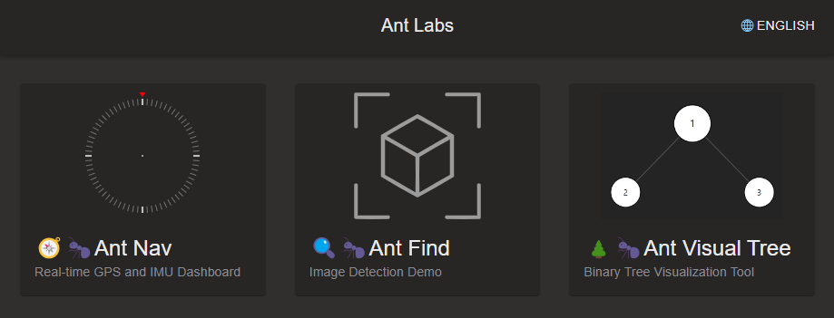

# Ant Labs

**Ant Labs** is a web-based project deployed on GitHub Pages. It serves as a navigation hub for various web projects that aim to explore and validate front-end technologies.
[https://labs.antknt47.com](https://labs.antknt47.com)

## Features
- A central hub for navigating to different web projects that demonstrate front-end techniques.
- Deployed on **GitHub Pages** for easy access and usage.
- Includes links to various experiments and implementations in front-end development.

## Technology Stack
- **React**: Used to build the user interface.
- **Vite**: Used for fast development and efficient builds.
- **JavaScript (JS)**: The main programming language for the project.

## Demo
The project is deployed on GitHub Pages at:
[Insert Demo Link Here]

## License
This project is licensed under the [MIT License](LICENSE).
